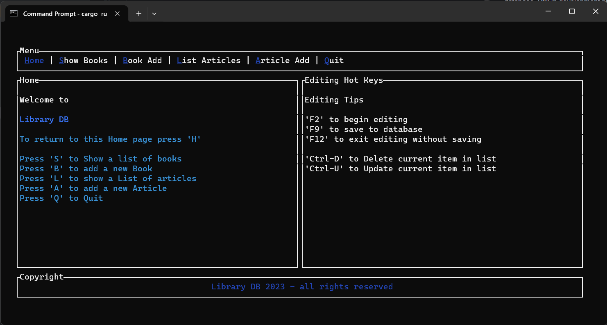

# bib_db
A bibliographic relational database built in Rust.  A basic implementation to store metadata about Books and Articles in the way a University library would keep track of what items they have available to their students. Other uses would be for public libraries, medical libraries.  These are called Library Catalogs... think of it as a digital version of a 'card catalog'.  

This is a TUI (Terminal User Interface) program that allows a user to store and retrieve data from a database.  For the first check-in it will show you items in a json database file.  Later I will change it to SQLite

# General usage
Initialize the TUI by using `cargo run --bin bib_db`
Inside the TUI the menu shows the following options:
- `Home` Intro page
- `Book` Book options page
- `Show Books` Display a list of books
- `New Book` Add a new book: not fully functioning yet. I have a text area to input, but have not implemented the save function yet
- `Article` nothing yet, but will display a list of articles like `Show Books`
- `Insert Article` nothing yet, but will be the same thing as `New Book`

## To implement later
### Sqlite
For the second check-in I want to utilize an Sqlite database for easy demonstration.  It could be changed for use with any SQL database such as MySQL, or PostgreSQL
Initialize a database using `cargo run --bin init_db`
This will create the database and all the relational tables needed to store data about different types of bibliographic data

### Tables created
- Master Entries
- - Automatically generates a unique cite_key. Also creates an entry_type based on the item type: Book or Article

- Books
- - Automatically generates a unique book_id, cite_key (reference), publisher_id (reference), month_year_id (reference)
- - Store a Book item with the following data: title, editor, pages, volume, edition, series, note

- Article
- - Automatically generates a unique cite_key (reference), article_id, publisher_id (reference), month_year_id (reference)
- - Stores the following data: title, journal, volume, pages, note, edition

### To implement later

These tables should be implemented later on as necessary
- Author
- - Automatically generates a unique cite_key (reference), author_id
- - Stores an author name

- Relationship
- - Automatically generates a unique parent_id, cite_key (reference), child_id

- Publisher
- - Automatically generates a unique publisher_id
- - Stores the following data: publisher, address

- Month Year
- - Automatically generates a unique month_year_id
- - Stores the following data: month, year

- Organizations
- - Automatically generates a unique organization_id
- - Stores the following data: organization, address

Add other item types: such as 'Audiobook', 'OnlineResource', 'Photograph', 'Painting', etc.

Add catalog searching, editing and indexing of items